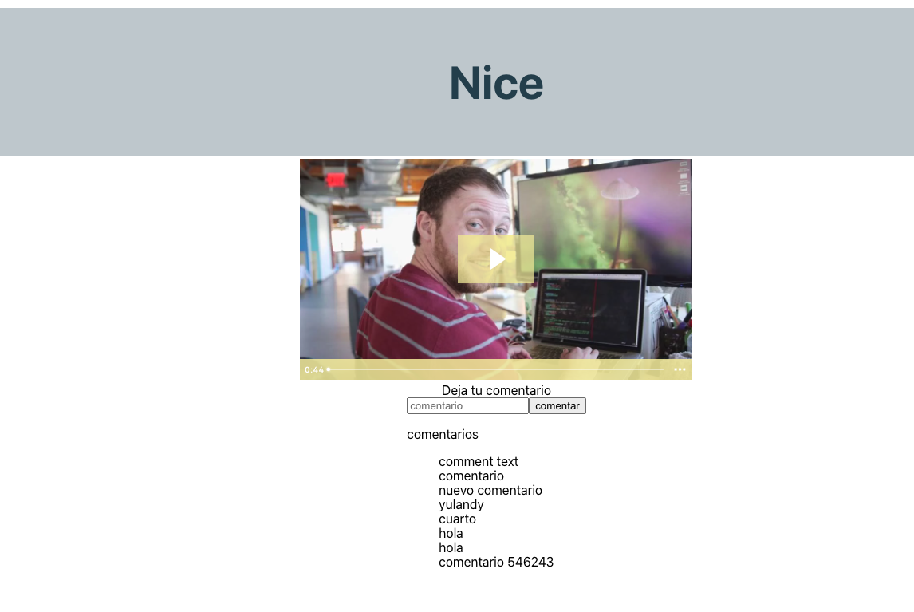

# Wisboo recruitment assignament

Front End uploading videos application , made as Wisboo's recruiting process.

# important
due to Wistia's account limititation, at most 3 videos can be uploaded, one was left as an example, but take into consideration that only 2 more videos can be uploaded, and even though api supports delete endpoints, logic to delete videos from my free wistia account, has not been implemented yet.

## Built With

- Js,
- React,

## Live Demo

[Live Demo Link](https://wisboo-assignament.netlify.app/)

## Getting Started

To get a local copy up and running follow these simple steps.

### Prerequisites
Code editor
Node

### Setup
Clone the repo

### Install
$yarn

### Usage
$yarn start 

### Deployment
$yarn build

## Authors

👤 **Andres Rodriguez**

- Github: [@andynarf](https://github.com/andynarf)

## Show your support

Give a ⭐️ if you like this project!

## 📝 License

This project is [MIT](lic.url) licensed.
